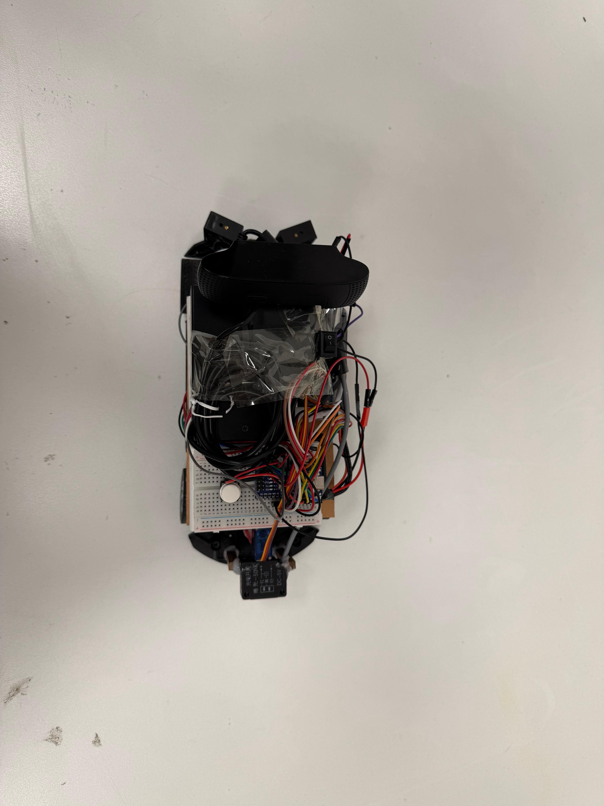

# WRO 2025 AZE Robot Playbook

This repo is the shared playbook for the WRO 2025 autonomous car build: code, wiring notes, and media from test runs.

## Contents
- Start Here
- Repository Map
- Concept Diagrams
- Robot Snapshot
- Software Rounds Overview
- Power & Sensor Layout
- How to Run a Round
- Robot Views

## Start Here
1. Read `codes/README.md` for the round-by-round walkthrough and key behaviors.
2. Use `schemas/POWER_SENSE.md` and `schemas/initial_schema.png` to verify wiring and pinouts.
3. Browse `RobotImages/` and `RobotVideos/` for field photos and practice footage.

## Repository Map
| Path | What you will find | Use it when |
| --- | --- | --- |
| `codes/` | Arduino sketches and Python helpers | You need to run, debug, or adjust behavior |
| `schemas/` | Wiring notes and pin maps | You are checking connections or power routing |
| `RobotImages/` | Build and field photos | You need quick visual context |
| `RobotVideos/` | Practice runs | You want performance examples |

## Concept Diagrams
These images summarize the control flow and the camera zoning used by the vision stack.

Flowchart of the main loop and the decision logic during laps.

Camera zones (free, front, contact) used by `codes/contact_zone_camera_logic.py`.

## Robot Snapshot
- **Compute:** Raspberry Pi 5 handles vision and high-level intent; Arduino Nano closes the loop on steering and drive.
- **Actuation:** L298N motor driver feeds the DC propulsion motor; an SG90 servo on pin D9 steers the nose.
- **Power:** dual LiPo packs (3S 1100 mAh for drive, 3S 500 mAh for the Nano) plus a USB-C bank for the Pi. Grounds are tied together -- details in `schemas/POWER_SENSE.md`.
- **Sensing:** TCS3200 color sensor watches floor pads while three IR modules (A0/A1/A2) act like bumpers. The Pi can nudge the Nano with `rasback`, `rasleft`, and `rasright` signals when it spots trouble.
- **Human interface:** a start button on D8 and a RUN/SAFE toggle on A4 so we can arm the car safely.

## Software Rounds Overview
Both rounds share the same hardware interface but handle the field a little differently. The full choreography lives in `codes/README.md`.

| Round | Goal | Highlights | File |
| --- | --- | --- | --- |
| Round 1 | Stay consistent and finish sectors | React to color pads, hug the lane with IR bumpers, count turns | `codes/round1.ino` |
| Round 2 | Add Pi-assisted maneuvers | Smooth lane changes, `front()` blockage checks, sharper back-out turn | `codes/round2.ino` |

## Power & Sensor Layout
Pull the full table from `schemas/POWER_SENSE.md`, but here are the pieces you reach for most often:

| Subsystem | Pins / Notes |
| --- | --- |
| Motor driver | `EN=D5`, `IN1=D6`, `IN2=D7` |
| Servo | `D9` PWM |
| Color sensor | `S0=D11`, `S1=D12`, `S2=D13`, `S3=A3`, `OUT=D10` |
| IR bumpers | left A1, right A0, back A2 |
| Pi intent lines | `rasback=D2`, `rasleft=D3`, `rasright=D4` |
| Safety toggle | `A4` (pull it LOW to keep the bot in SAFE) |

## How to Run a Round
1. Charge both LiPos and the Pi's bank; confirm all grounds are common.
2. Flip the SAFE toggle, power up the Pi and Nano, then upload either `round1.ino` or `round2.ino` from the Arduino IDE.
3. Place the robot in its parking bay, hold it steady, and press the start button. The sketch waits for that HIGH edge before moving.
4. Watch the telemetry in the Arduino Serial Monitor (9600 baud) if you need to confirm color readings or obstacle flags.

## Robot Views
| Left | Front | Right |
| --- | --- | --- |
|  |  |  |

| Back | Top | Bottom |
| --- | --- | --- |
|  |  |  |

